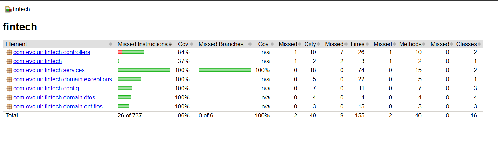

# Backend – Gestão de Clientes RPE

Este é o backend da aplicação **Gestão de Clientes RPE**, desenvolvida como parte do processo seletivo da RPE. Ele fornece uma API RESTful para gerenciamento de clientes, controle de faturas e registro de pagamentos.

---

## Tecnologias Utilizadas

* **Java 21**
* **Spring Boot** – versão 3.5.3
* **Maven** – gerenciador de dependências e build
* **PostgreSQL** – banco de dados relacional (via Docker)
* **Spring Data JPA** – persistência de dados
* **Hibernate Validator** – validação de campos
* **Swagger/OpenAPI** – documentação interativa da API
* **JUnit + Mockito** – testes unitários e de integração
* **JaCoCo** – cobertura de testes

---

## Pré-requisitos

* Java JDK 21 instalado
* Maven 3.8+ instalado
* Docker (para o banco de dados PostgreSQL)

### Verificando versões

```bash
java -version
mvn -version
docker --version
````

---

## Como Rodar o Projeto

### 1. Clone o repositório

```bash
git clone https://github.com/lisscodes/desafio-rpe.git
```

### 2. Acesse o diretório do backend

```bash
cd backend
```

### 3. Suba o banco de dados PostgreSQL via Docker

```bash
docker compose up -d
```

> O PostgreSQL estará disponível em `localhost:5431` com as credenciais:
>
> * **Database**: `fintech`
> * **User**: `postgres`
> * **Password**: `postgres`

### 4. Execute a aplicação localmente

```bash
./mvnw spring-boot:run
```

> A API estará disponível em: [http://localhost:8080](http://localhost:8080)

---

## Executando os Testes

Para rodar todos os testes da aplicação:

```bash
./mvnw clean test
```

---

## Cobertura de Testes

A cobertura de testes foi gerada com **JaCoCo** e pode ser acessada visualmente no caminho:

```
target/site/jacoco/index.html
```

Abaixo, a visualização da cobertura atual:



A cobertura total do backend está em **96%** das instruções de código.

---

## Documentação da API

A documentação interativa da API está disponível via Swagger após iniciar o servidor:

🔗 [http://localhost:8080/swagger-ui.html](http://localhost:8080/swagger-ui.html)

---

## Estrutura Principal

```bash
src/
├── controllers/        # Endpoints da API
├── domain/
│   ├── dtos/           # Objetos de transferência (DTOs)
│   ├── entities/       # Entidades JPA
│   └── exceptions/     # Tratamento de exceções personalizadas
├── repositories/       # Interfaces de persistência (Spring Data)
├── services/           # Regras de negócio e lógica de domínio
└── FintechApplication.java   # Classe principal da aplicação Spring Boot
```
